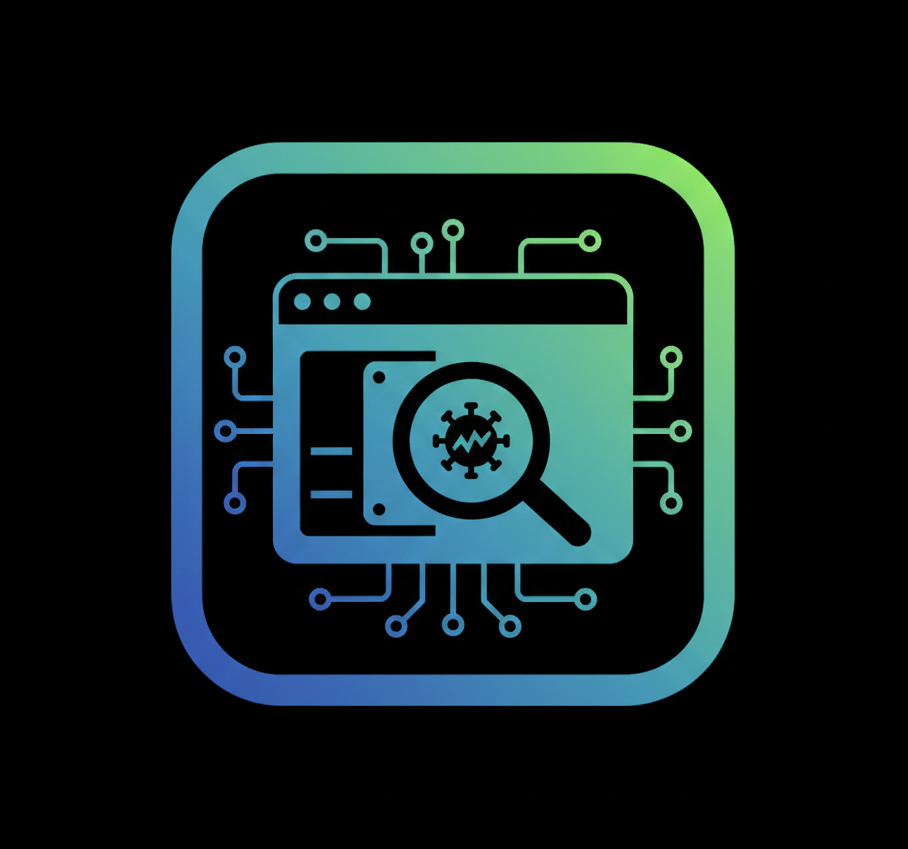

<<<<<<< HEAD
## Sandboxed

<p align="center">
  
</p>

Un **sandbox** es un entorno de pruebas aislado en el que se pueden ejecutar aplicaciones o programas sin afectar el sistema operativo subyacente. Este repositorio te servirá para **analizar malware en un entorno seguro**, ya que incluye herramientas útiles y fáciles de usar.

---

## ⚙️ Requisitos

- Sistema operativo: Linux (Ubuntu recomendado)
- Python 3.8 o superior
- Permisos de administrador para ejecutar `setup.sh`

---

## 🚀 Instalación

Clona el repositorio y accede al directorio:
=======
# Sandboxed: Entorno Profesional de Análisis de Malware


**Sandboxed** es una herramienta de orquestación de análisis estático orientada a DevSecOps. Proporciona un entorno estructurado, aislado y ético para que investigadores y profesionales de seguridad examinen archivos sospechosos (ejecutables de Windows, binarios de Linux y documentos) utilizando herramientas estándar de la industria.

---

## 🎯 Objetivo del Proyecto

Este repositorio está diseñado para demostrar un enfoque profesional en la investigación de malware. Se centra en la automatización, documentación técnica clara y la separación de un portafolio público (GitHub) de un laboratorio de investigación totalmente funcional (GitLab).

## ⚖️ Propósito Ético y Educativo

Esta herramienta es estrictamente para **investigación educativa y defensiva**.
- **Advertencia de Uso**: La ejecución de payloads o el análisis de malware SOLAMENTE debe realizarse en máquinas virtuales aisladas.
- **Responsabilidad**: El usuario es el único responsable del cumplimiento legal y la seguridad.

---

## 🏗️ Estructura del Repositorio

- **src/**: Lógica central de orquestación en Python.
- **scripts/**: Scripts de instalación y configuración del entorno.
- **docs/**: Documentación técnica detallada (`ARCHITECTURE.md`).
- **diagrams/**: Flujo del sistema y arquitectura visual (`FLOW.md`).
- **tests/**: Verificaciones automáticas y controles de seguridad.
- **configs/**: Plantillas de configuración.

---

## 🚀 Empezando

### 📋 Prerrequisitos

- OS: Linux (Ubuntu/Debian recomendado)
- Python 3.8+
- Privilegios de root para la instalación de herramientas.

### 🛠️ Instalación
>>>>>>> 04cc696

```bash
git clone https://github.com/bl4ck44/Sandboxed.git
cd Sandboxed
<<<<<<< HEAD
```

Configura el entorno:

```bash
chmod +x setup.sh
sudo bash setup.sh
=======
sudo bash scripts/setup.sh
```

### 🔍 Uso

```bash
python3 src/sandbox.py
>>>>>>> 04cc696
```

---

<<<<<<< HEAD
## ▶️ Uso

Ejecuta el script principal:

```bash
python3 sandbox.py
```

---

## 🛠️ Contenido de herramientas

### Analizar ejecutables de Windows
- **Propiedades estáticas:** manalyze, peframe  
- **Strings y Deofuscación:** pestr, flarestrings, floss  

### Binarios Linux de ingeniería inversa
- **Propiedades estáticas:** trid, exiftool  
- **Desmontar/Descompilar:** cutter  

### Examinar documentos sospechosos
- **Archivos de Microsoft Office:** pcodedmp, olevba, xlmdeobfuscator  
- **Archivos PDF:** pdfextract, pdfdecrypt, pdfresurrect  

---

## 📜 Licencia

Este proyecto está bajo la licencia GPL. Puedes usarlo libremente con fines educativos y de investigación.

---

## ⚠️ Aviso

Este script ha sido desarrollado únicamente con fines **educativos y de investigación en ciberseguridad**. El uso indebido de este material puede ser **ilegal**. No me responsabilizo del mal uso ni de los daños que puedan ocasionarse por su ejecución.
=======
## 🔄 Integración DevSecOps

### GitHub (Portafolio Público)

La versión pública se centra en la arquitectura y las mejores prácticas. Excluye pruebas funcionales o configuraciones sensibles para mantener un perfil limpio y profesional.

### GitLab (Laboratorio Privado)

El laboratorio privado incluye:
- **Pipelines de CI/CD**: Linting automático y análisis de seguridad.
- **Suite de Pruebas Completa**: Pruebas funcionales y de integración.
- **Herramientas Avanzadas**: Payloads y configuraciones especializadas.

---

## 🛠️ Herramientas Integradas

| Categoría | Herramientas |
| :--- | :--- |
| **Windows** | `manalyze`, `peframe`, `pestr`, `flarestrings`, `floss` |
| **Linux** | `trid`, `exiftool`, `cutter` |
| **Docs/PDF** | `pcodedmp`, `olevba`, `xlmdeobfuscator`, `pdfextract`, `pdfresurrect` |
>>>>>>> 04cc696
