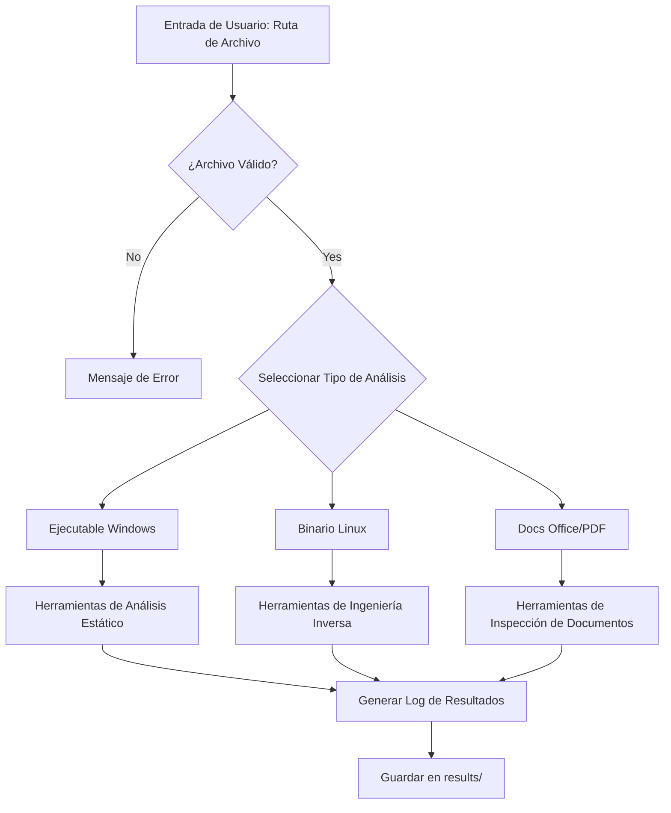

# Flujo del Sistema

```mermaid
graph TD
    A[Entrada de Usuario: Ruta de Archivo] --> B{¿Archivo Válido?}
    B -- No --> C[Mensaje de Error]
    B -- Yes --> D{Seleccionar Tipo de Análisis}
    
    D --> E[Ejecutable Windows]
    D --> F[Binario Linux]
    D --> G[Docs Office/PDF]
    
    E --> H[Herramientas de Análisis Estático]
    F --> I[Herramientas de Ingeniería Inversa]
    G --> J[Herramientas de Inspección de Documentos]
    
    H --> K[Generar Log de Resultados]
    I --> K
    J --> K
    
    K --> L[Guardar en results/]
```
